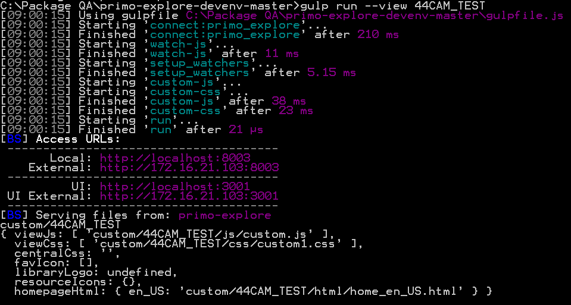
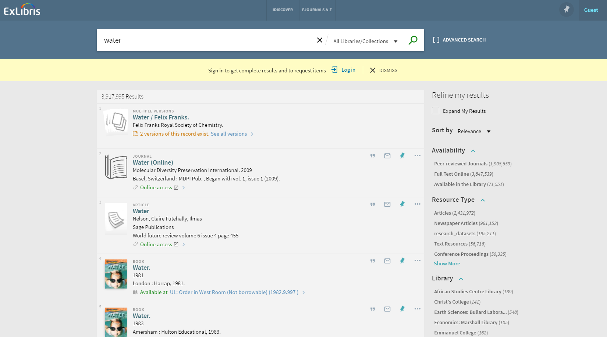
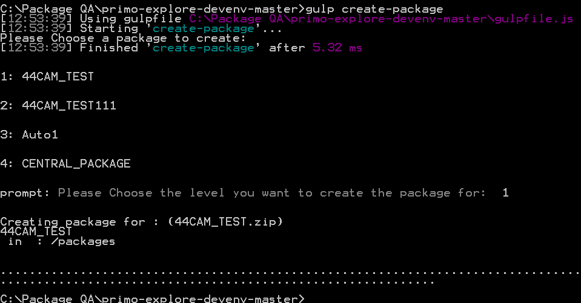
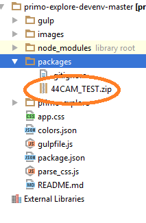

# The Primo New UI Customization Workflow Development Environment

##Structure

- <b>gulp directory</b> : holds the various build scripts for the environment and the configuration file (config.js) in which the target proxy server is defined

- <b>node_modules directory</b> : holds the various 3rd party modules that are required to run the system , Those modules are defined in the:
`./package.json` file

- <b>packages directory</b> : once your development package is ready you will be able to build it using the `gulp create-package` command that will create the zipped package file you define in this folder

- <b>primo-explore directory</b> : consists of 2 directories :
   1. <b> custom </b> : - where you will place your custimization packages
   2. <b> tmp </b> : just a place to hold some of your temporary files

##Overview

The development package allows you to configure :

- css

- images

- html

- javascript

- For each configuration type there is a specified folder in the custom package folder (that can be downloaded from your Primo Back Office, or from the [GitHub Repository](https://github.com/ExLibrisGroup/primo-explore-package "primo-explore-package repository"))
- In each folder you will find a specific README.md file with recipes/examples.

- Follow the links below to learn more about the different customization options:

    [CSS](https://github.com/ExLibrisGroup/primo-explore-package/tree/master/VIEW_CODE/css "css documentation")

    [HTML](https://github.com/ExLibrisGroup/primo-explore-package/tree/master/VIEW_CODE/html "html documentation")

    [Images](https://github.com/ExLibrisGroup/primo-explore-package/tree/master/VIEW_CODE/img "images documentation")

    [JavaScript](https://github.com/ExLibrisGroup/primo-explore-package/tree/master/VIEW_CODE/js "javascript documentation")

##Installation

-  Download the project from this repository and place it on your pc

-  Unzip the file you downloaded

-  Download and install nodejs version 4.2.x

> https://nodejs.org/en/download/

-  Run the command (from command line) `npm install npm@3.3.12 -g`

-  Restart the computer

-  Run `npm install -g gulp` from the command line

-  Open a new command line window

-  cd to the project base directory (`your-drive-letter:\**\**\primo-explore-devenv`/`your-drive-letter:\**\**\primo-explore-devenv-master`)

-  Run `npm install`. This should install all node modules needed for gulp

    

-  Edit the proxy server (Your Primo Front-End Url) under /gulp/config.js: `var PROXY_SERVER = http://your-server:your-port`,

-  Note that for SSL environments (https) define the server as: `var PROXY_SERVER = https://your-server:443`
-  Go to your custom package folder and start your customizations:
    1.  Download from your Primo Back Office, or from the [GitHub Repository](https://github.com/ExLibrisGroup/primo-explore-package "primo-explore-package repository")) a new package folder.
    In case you already defined a package and loaded it to the BO - make sure you download it or else you will not see your previous changes.

    2.  Save the package folder(the VIEW_CODE folder) into your development environment under the primo-explore/custom directory

    your directory tree should look similar to this:

    

-  In the command line run : `gulp run --view <the VIEW_CODE folder>` - This will start your local server

    example:

    `gulp run --view Auto1`

     will start the environment taking the customizations from the Auto1 folder

    

-  Open a browser and type in the following url:

   `localhost:8003/primo-explore/?vid=your-view-code`

    example: http://localhost:8003/primo-explore/search?vid=Auto1

-  Now you can perform searches on your browser and receive results from your actual defined proxy server

    Note: Once you start working with the environment you will discover that the best results are achived by working in incognito mode, or clearing your browser cache before you start the server

    

-  You can get immediate feedback on your changes by refreshing the browser

-  perform your changes according to the documentation/examples in:

    [CSS](https://github.com/ExLibrisGroup/primo-explore-package/tree/master/VIEW_CODE/css "css documentation")

    [HTML](https://github.com/ExLibrisGroup/primo-explore-package/tree/master/VIEW_CODE/html "html documentation")

    [Images](https://github.com/ExLibrisGroup/primo-explore-package/tree/master/VIEW_CODE/img "images documentation")

    [JavaScript](https://github.com/ExLibrisGroup/primo-explore-package/tree/master/VIEW_CODE/js "javascript documentation")

##Publishing packages
-   Once you finish customizing the package , you can zip it and upload it via the Primo BackOffice
-   Run the command (from command line) `gulp create-package`
-   You will be prompted with a menu specifing all of the possible packages you can build:

    

    
